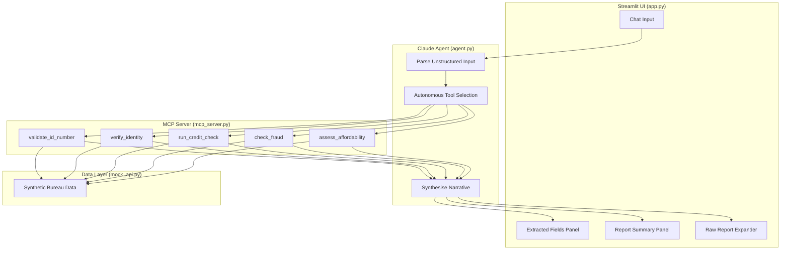
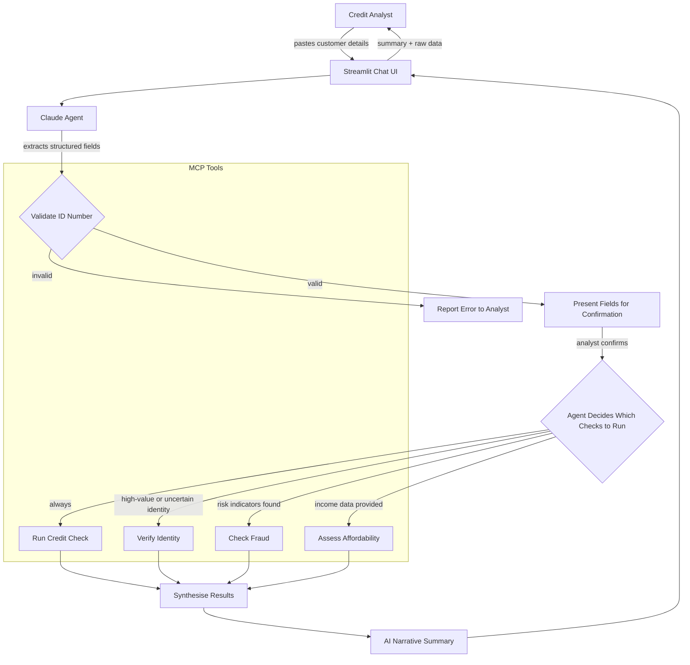

# AI Credit Bureau Assistant

An AI-powered credit check workflow that replaces manual data entry and dense report reading with a conversational interface. A credit analyst pastes or types customer details, and an AI agent extracts structured data, autonomously decides which bureau checks to run, and returns a plain-English summary.

Built for an internal hackathon exploring AI integration into existing credit bureau products.

## Architecture



## How It Works



The agent's autonomous tool selection is the key differentiator — it reasons about which checks are appropriate based on the application context, rather than following a fixed pipeline.

## Quick Start

```bash
# create and activate virtual environment
uv venv .venv
source .venv/bin/activate

# install dependencies
uv pip install -r requirements.txt

# configure API key
cp .env.example .env
# edit .env and add your Anthropic API key

# run the app
streamlit run app.py
```

## Demo Scenarios

| Scenario | Applicant | ID Number | What Happens |
|----------|-----------|-----------|--------------|
| Clean profile | Sarah Johnson | `9001012000088` | Validates ID, runs credit check + affordability. Clean score (720), comfortable DTI. |
| Full investigation | James Mbeki | `8805125012082` | High-value home loan triggers all 5 tools. Medium risk (685), identity verified, no fraud, tight affordability. |
| Risk flags | Thandi Nkosi | `8503203456087` | Credit check reveals defaults and enquiry spike. Agent autonomously triggers fraud check — finds address mismatch and suspicious patterns. |
| Bad data | Any invalid ID | `8805125012089` | Caught at validation before any API calls. Luhn checksum fails. |

## Project Structure

```
ai-product/
├── app.py              # streamlit entry point
├── agent.py            # claude agent orchestration
├── mcp_server.py       # MCP server with 5 credit bureau tools
├── prompts.py          # system prompts for extraction and summarisation
├── mock_api.py         # synthetic credit bureau data
├── requirements.txt    # python dependencies
├── .env.example        # API key template
└── .gitignore
```

## MCP Tools

| Tool | Purpose | Autonomous Trigger |
|------|---------|--------------------|
| `validate_id_number` | SA ID format, Luhn checksum, DOB/gender extraction | Always — first step |
| `verify_identity` | Home Affairs registry check | High-value applications or identity uncertainty |
| `run_credit_check` | Full bureau report: score, accounts, payment history, adverse info | Always — core check |
| `check_fraud` | Fraud indicators, blacklist screening, address/phone cross-reference | Triggered by risk indicators in credit report |
| `assess_affordability` | Debt-to-income ratio, repayment capacity calculation | When income data is provided |

## Constraints

- **All data is synthetic** — the mock API returns realistic but fabricated South African credit data.
- **No credit decisions** — the assistant provides analysis, never approval or decline language.
- **AI-generated disclaimer** — all summaries are clearly marked as advisory.
- **Privacy by design** — no real PII is used or stored.

## Dependencies

- [Anthropic Python SDK](https://github.com/anthropics/anthropic-sdk-python) — Claude API with tool use
- [MCP Python SDK](https://github.com/modelcontextprotocol/python-sdk) — FastMCP server framework
- [Streamlit](https://streamlit.io/) — chat UI
- [python-dotenv](https://github.com/theskumar/python-dotenv) — environment variable management
